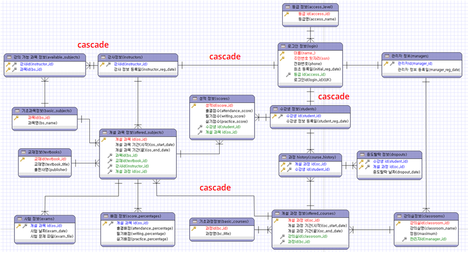

# SIST Score Management System
This program is a web score management system based on Spring MVC and MyBatis to process necessary information for the overall educational operations of (tentatively named) the SIST Education Center. In this system users can use features of the program according to their user rights after login. A student account has a right to check out their courses and grades. Instructor account has rights to manage course, exam and grade information. Manager has rights to handle overall features of the program.

## Technology
* Java, MySQL, JSP, Servlet, Spring MVC Framework and MyBatis

## Feature
### Student
* View Personal Info - Name, Phone, Initial Registered Date
* View Score - View a List of courses that a student is attending, detailed information of courses and subjects, exam information, exam scores
### Instructor
* View Personal Info - Name, Phone, Initial Registered Date, Available Subjects
* View Schedule - View an instructor’s personal class schedule, and check a list of students by each course/subject
* Manage Test Info - Insert and delete attendance, writing and practice score-percentage and a date of exam and exam file by each subject after it finishes
* Manage Score - Grade and delete a student’s score by each subject
### Manager
* Manage Basic Info - Insert and delete a basic course, basic subject, classroom and textbook
* Manage Instructor Account - Update and delete an instructor’s personal information, his/her schedule
* Manage Offered Course and Subject - Update and delete an offered course and subject based on a list of basic course/subject/students
* Manage Student - View, update and delete a student’s information/course history and drop out or cancle his/her course
* View Score - Get a list of scores by each course/subject or each student

## Demo Videos
* Student - <https://youtu.be/GALUBkGqN5Y>
* Instructor - <https://youtu.be/tfNqw0qo15E>
* Manager - <https://youtu.be/qsTqO9MJmME>

## Database Table

